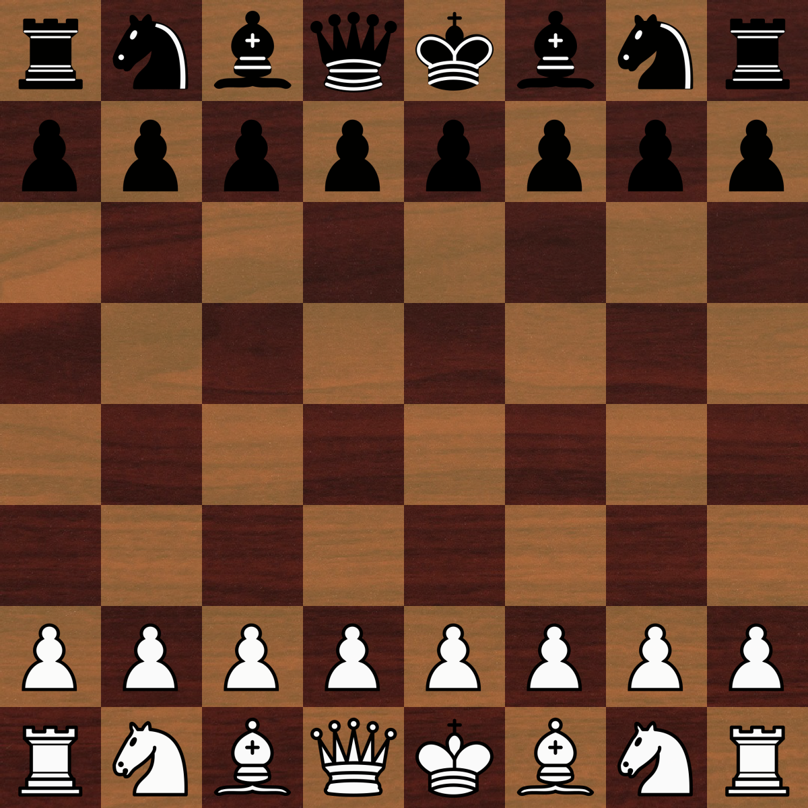

# AICOB
### Artificially Intelligent Chess Oriented Bot

A chess AI project made in my free time in order to experiment with different game AI algorithms!
Made in Python using pygame.

Send comments/bugs to wrcooper3000@gmail.com

## Features
* AI moves generated by minimax decision algorithm optimized with alpha-beta pruning
* Adjustable algorithm search tree depth
* Toggle between player-controlled and AI controlled moves
* Generated PGN for each game, output to "pgn.txt"
* Saves previously calculated moves in a move dictionary represented in a json file

## Getting Started!
### Requirements
* Python 3+

##

###### Note: A virtual environment is recommended in case of the unlikely event that the requirement packages installed conflict with programs on your computer. 
If this does not matter to you, then the requirements can be installed to directly to your computer with the steps listed under "Without a virtual environment".

### On macOS/Linux:
	
##### 1. Download the Project
Navigate to your desired directory and enter the command:

	$ clone https://github.com/wrcooper/AICOB.git
	$ cd AICOB
	
##### 2. Create a virtual environment
	$ python3 -m virtualenv env
	
##### 3. Activate the virtual environment and install dependencies
	$ source ./env/bin/activate
	$ pip install -r requirements.txt
	
##### 4. Run the program!
	$ python3 aicob.py
	
##### 5. To leave the environment when finished
	$ deactivate

#### Without a virtual environment:

##### 1. Download the Project
Navigate to your desired directory and enter the command:

	$ clone https://github.com/wrcooper/AICOB.git
	$ cd AICOB

##### 2. Install dependencies
	$ pip install -r requirements.txt

##### 3. Run the program!
	$ python3 aicob.py
	
##	
	
### On Windows:
	
##### 1. Download the Project
Navigate to your desired directory and enter the command:

	$ clone https://github.com/wrcooper/AICOB.git
	$ cd AICOB
	
##### 2. Create a virtual environment
	$ py -m virtualenv env
	
##### 3. Activate the virtual environment and install dependencies
	$ source ./env/Scripts/activate
	$ pip install -r requirements.txt
	
##### 4. Run the program!
	$ py aicob.py
	
##### 5. To leave the environment when finished
	$ deactivate

#### Without a virtual environment:

##### 1. Download the Project
Navigate to your desired directory and enter the command:

	$ clone https://github.com/wrcooper/AICOB.git
	$ cd AICOB

##### 2. Install dependencies
	$ pip install -r requirements.txt

##### 3. Run the program!
	$ py aicob.py
	
## Future Plans
* Add additional AI algorithms that the user can choose from
* Optimize/clean up code
* Implement Universal Chess Interface Support
* Add a move timer
* Enhance endgame moves
* Have AI break out of moves that lead to a repitition
* Improve AI performance

### Farther Future Plans
* Implement a chess chatbot to provide companionship, competition, and guidance to the player